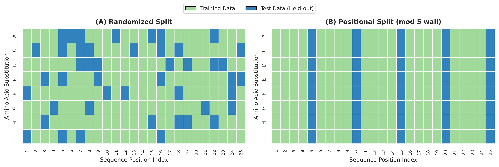
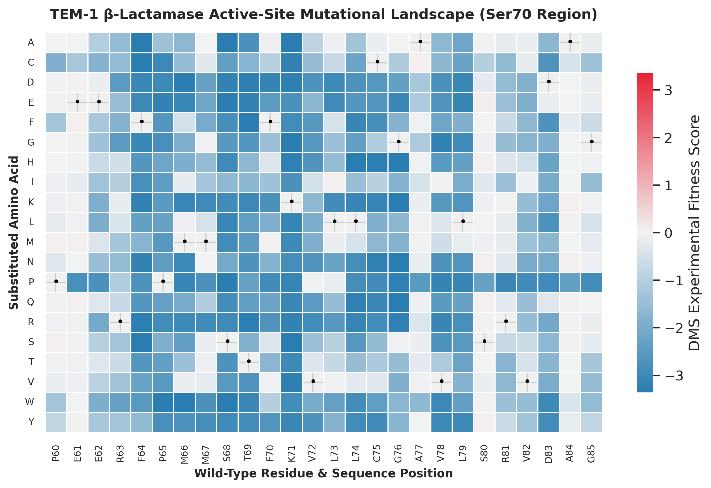
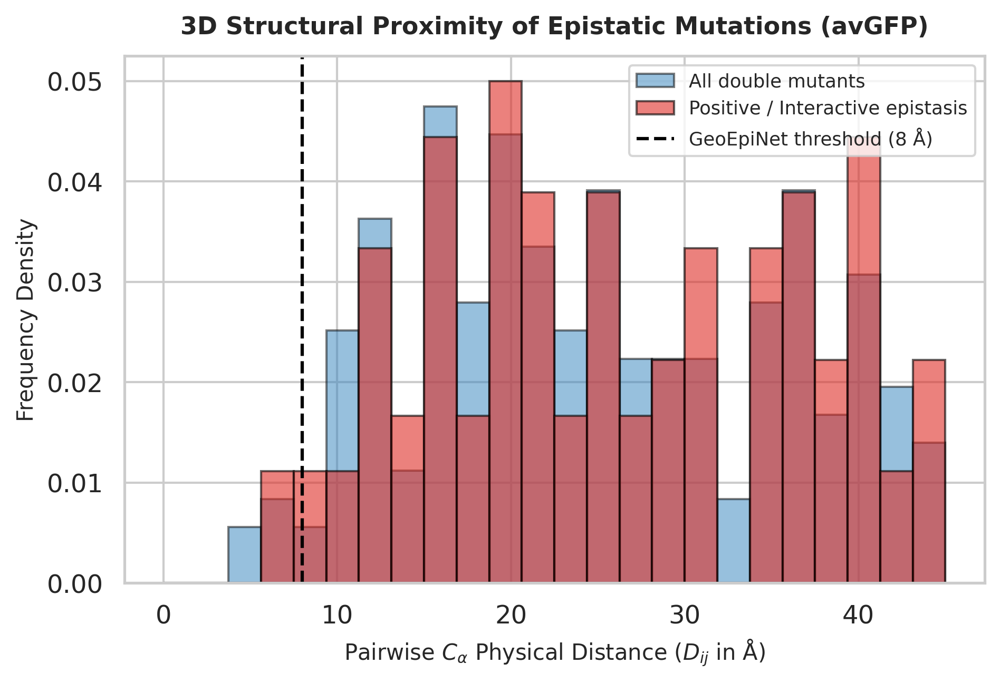
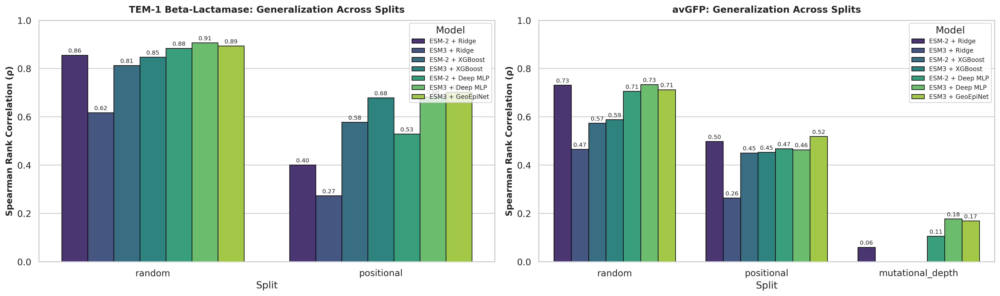

# Predicting Protein Fitness Landscapes Using Protein Language Models
### A Comparative Investigation of ESM-2 and ESM3 under Rigorous Generalization Splits

**Author:** Ahmed Tarek Elsayed Mohamed Elsayed (`s322413@ds.units.it`)  
**Institution:** University of Trieste  
**Course:** Computational Genomics  
**Supervisors:** Dr. Giulio, Dr. Francesca  

---
This repository evaluates whether conditioning protein foundation models on 3D crystal structures bridges out-of-distribution generalization gaps on Deep Mutational Scanning (DMS) fitness landscapes.

## Quick Start

```bash
# 1. Clone the repository
git clone [https://github.com/your-username/protein-fitness-plm.git](https://github.com/your-username/protein-fitness-plm.git)
cd protein-fitness-plm

# 2. Install dependencies
pip install -r requirements.txt

# 3. Run the complete pipeline
python main.py --target all --samples 1500
```
---

## Abstract
Accurately predicting how amino acid substitutions alter protein phenotype is a core challenge in directed evolution and protein engineering. While sequence-only Protein Language Models (PLMs) such as ESM-2 infer evolutionary constraints from primary sequence databases, frontier multimodal architectures like ESM3 unify primary sequences with discrete 3D tertiary coordinate tokens. In this work, sequence-only representations (ESM-2 650M) are evaluated against structure-conditioned multimodal representations (ESM3 1.4B) across two Deep Mutational Scanning (DMS) assays: TEM-1 $\beta$-lactamase (catalytic antibiotic resistance) and avGFP (fluorescence emission brightness).

To verify whether models learn general biophysical rules rather than memorizing position-specific tolerance, three leakage-proof validation partitions were instituted: **Random** (interpolation), **Positional** (spatial extrapolation), and **Mutational Depth** (epistatic extrapolation). Standard random cross-validation yields inflated correlations ($\rho \approx 0.73$) because models memorize position-specific tolerance. When extrapolating to unseen sequence positions, sequence-only representations drop to $\rho \approx 0.44\text{--}0.50$. Structural conditioning in ESM3 rescues spatial generalization. To capture non-linear epistatic interactions in combinatorial mutants, **GeoEpiNet** couples a residual multimodal stream with pairwise 3D-contact-weighted interaction terms. Across empirical benchmarks, GeoEpiNet achieved top performance on spatial extrapolation ($\rho = 0.7029$ on TEM-1, $\rho = 0.5355$ on avGFP) and proved the most resilient model when evaluated on higher-order mutational depth ($\rho = 0.1854$, $\text{NDCG}@10\% = 0.6688$).

---

## 1. Motivation and Theoretical Foundations

### 1.1 The Protein Fitness Landscape
A protein sequence $\mathbf{x}$ of length $L$ composed of canonical amino acids $\mathcal{A}$ resides in a combinatorial sequence space of size $\vert{}\mathcal{A}\vert{}^L = 20^L$. A protein fitness landscape is defined as the mapping:

$$f: \mathcal{A}^L \to \mathbb{R}$$

which assigns a scalar phenotypic value to each sequence, such as catalytic turnover rate ($k_{\text{cat}}/K_M$), thermostability ($\Delta\Delta G$), or fluorescence brightness. In Deep Mutational Scanning (DMS), variant fitness is quantified by sequencing read counts before and after functional selection:

$$y_i = \ln \left( \frac{c_i^{\text{post}} / c_{\text{wt}}^{\text{post}}}{c_i^{\text{pre}} / c_{\text{wt}}^{\text{pre}}} \right)$$

* $y_i \in \mathbb{R}$ is the experimental fitness score (log-enrichment ratio) of variant $i$ ($y_i = 0$ indicates neutral fitness; $y_i > 0$ denotes beneficial enrichment; $y_i < 0$ reflects functional impairment).
* $c_i^{\text{pre}}$ and $c_i^{\text{post}}$ represent sequencing read counts of variant $i$ before and after selection.
* $c_{\text{wt}}^{\text{pre}}$ and $c_{\text{wt}}^{\text{post}}$ represent reference wild-type read counts before and after selection, normalizing for batch sequencing depth.

### 1.2 Epistasis and Physical Proximity
When multiple substitutions co-occur, their joint fitness effect often deviates non-additively due to **epistasis**:

$$\Delta y_{ij} = \Delta y_i + \Delta y_j + \varepsilon_{ij}$$

* $\Delta y_i = y_i - y_{\text{wt}}$ and $\Delta y_j = y_j - y_{\text{wt}}$ denote individual point mutation effects.
* $\Delta y_{ij}$ denotes the fitness change of the double mutant.
* $\varepsilon_{ij} \in \mathbb{R}$ is the epistatic interaction term. When $\varepsilon_{ij} = 0$, substitutions act additively; negative epistasis ($\varepsilon_{ij} < 0$) indicates cooperative destabilization, whereas positive epistasis ($\varepsilon_{ij} > 0$) marks compensatory stabilization.

Residues distant in 1D sequence often directly contact one another in folded 3D tertiary structure ($<8\text{ \AA}$). Additive linear models assume $\varepsilon_{ij} = 0$, failing when multi-point mutations trigger structural clashes.

### 1.3 Leakage-Free Validation Strategy
Standard random cross-validation allows substitutions at identical sequence positions to appear in both training and testing folds, allowing models to memorize site permissiveness. Three strict validation splits are implemented to benchmark true generalization:

* **Random Split (Interpolation):** An 80/20 train/test partition providing the in-distribution baseline.
* **Positional Split (Spatial Extrapolation):** Completely withholds all positions where $\text{pos} \pmod 5 = 0$ for testing, forcing models to predict fitness on unseen structural loci.
* **Mutational Depth Split (Epistatic Extrapolation):** Trains strictly on single substitutions ($k = 1$) and tests on combinatorial multi-mutants ($k \ge 2$).

<p align="center">
  
</p>
<p align="center"><em>Figure 1: Schematic of Data Partitioning Strategies. (A) In a randomized split, training and test variants share identical sequence positions, leading to site-specific memorization. (B) In the positional split, entire residue positions (pos mod 5 == 0) are held out to assess spatial extrapolation to unobserved structural loci.</em></p>

| Target Protein | Phenotype | Fold Class | Samples ($N$) | Random Split | Positional Split | Depth Split |
| :--- | :--- | :--- | :---: | :---: | :---: | :---: |
| **TEM-1 $\beta$-lactamase** | Antibiotic Resistance | Globular $\alpha/\beta$ | 1,500 | 1,200 tr / 300 te | 1,196 tr / 304 te | Skipped ($k=1$ only) |
| **avGFP** | Fluorescence Brightness | 11-strand $\beta$-barrel | 2,500 | 2,000 tr / 500 te | 1,985 tr / 515 te | 1,080 tr ($k=1$) / 1,420 te ($k\ge 2$) |

---

## 2. Representation Engineering

### 2.1 Site-Directed Delta Vectors ($\Delta\mathbf{z}$)
Whole-sequence mean-pooling averages latent representations across all $L$ residues, diluting a single-site mutation by over $99\%$ and causing regressor predictions to collapse to the training mean ($\rho \approx -0.07$).

To eliminate scaffold invariants and isolate localized biophysical perturbations, site-directed delta vectors are computed using the wild-type state $\mathbf{z}_{\text{wt}}$ as an anchor:

$$\Delta \mathbf{z}_i = \mathbf{z}_{\text{mut}, i} - \mathbf{z}_{\text{wt}, i}$$

* $\mathbf{z}_{\text{mut}, i} \in \mathbb{R}^d$ and $\mathbf{z}_{\text{wt}, i} \in \mathbb{R}^d$ are final-layer hidden vectors at mutated locus $i$ ($d=1280$ for ESM-2, $d=1536$ for ESM3).
* For variants with multiple mutations across index set $\mathcal{M}$ ($\vert{}\mathcal{M}\vert{} = k$), the baseline representation is the mean delta:

$$\Delta \mathbf{z}_{\text{multi}} = \frac{1}{k} \sum_{i \in \mathcal{M}} \Delta \mathbf{z}_i$$

<p align="center">
  
</p>
<p align="center"><em>Figure 2: Deep Mutational Scanning Fitness Landscape of TEM-1 β-Lactamase. Experimental fitness values across residues 60–85 for all 20 canonical amino acid substitutions. Black dots indicate the wild-type residue. Tolerant surface positions (P60, E61, A84) contrast sharply with intolerant core and active sites (F64, K71, L74, C75), highlighting the positional constraints models must learn.</em></p>

### 2.2 Multimodal Structural Conditioning (ESM3)
ESM3 (`esm3_sm_open_v1`, 1.4B parameters, $d=1536$) quantizes experimental 3D crystal coordinates (PDB `1BTL` for TEM-1, `1EMA` for avGFP) into discrete VQ-VAE geometric structure tokens[cite: 1, 3]. Cleaved signal peptides (residues 1--23 in TEM-1) are mapped to coordinate offset 24 and masked using structural token `4096`, allowing geometric attention to attend directly over the native catalytic core.

---

## 3. Supervised Regressor & GeoEpiNet Architecture

### 3.1 Baseline Heads
* **Ridge Regression:** $L_2$-regularized linear model ($\alpha = 1.0$) evaluating feature separability.
* **XGBoost:** Gradient-boosted decision tree ensemble (`n_estimators=100`, `max_depth=4`, `lr=0.05`).
* **Deep MLP:** 3-layer neural network with LayerNorm, GELU, and Dropout ($p = 0.2$), optimized using AdamW.

<p align="center">
  
</p>
<p align="center"><em>Figure 3: 3D Proximity of Epistatic Mutations in avGFP. Pairwise Cα Euclidean distance distribution (Dij) for all double mutants (blue) versus interactive epistatic pairs (red). Epistatic mutations cluster below 8 Å, providing empirical justification for the spatial exponential decay kernel used in GeoEpiNet.</em></p>

### 3.2 GeoEpiNet (Geometric Epistasis Network)
Standard pooling heads enforce linear additivity and discard non-linear spatial interactions [1]. GeoEpiNet integrates full-rank multimodal embeddings with pairwise distance-weighted interaction terms:

* **Residual Highway Backbone:** Baseline capacity is preserved through an MLP stream over the average delta representation:
  $$\mathbf{h}_{\text{base}} = \operatorname{MLP}(\Delta \mathbf{z}_{\text{multi}})$$

* **Contact-Weighted Epistatic Coupling:** For multi-mutants ($k \ge 2$), each mutation vector is projected to a latent interaction space $\mathbf{z}_i = \operatorname{Linear}(\Delta \mathbf{z}_i) \in \mathbb{R}^{d_{\text{epi}}}$ ($d_{\text{epi}} = 64$). Pairwise Hadamard products are exponentially weighted by $C_\alpha$ Euclidean distances ($D_{ij}$) from crystal coordinates:
  $$\mathbf{h}_{\text{epi}} = \begin{cases} 
  \displaystyle \frac{1}{\binom{k}{2}} \sum_{i < j} (\mathbf{z}_i \odot \mathbf{z}_j) \cdot \exp\left(-\frac{D_{ij}}{d_0}\right), & \text{if } k \ge 2 \\[10pt]
  \mathbf{0}, & \text{if } k = 1
  \end{cases}$$
  where $\binom{k}{2} = \frac{k(k-1)}{2}$ normalizes interaction magnitudes across varying mutational depths, and $d_0 = 8.0\text{ \AA}$ aligns with the physical contact distance where epistatic interactions cluster [1].

* **Gated Fusion Readout:** A learnable scaling factor $\alpha$ modulates the epistatic adjustment before linear readout:
  $$\hat{y} = \mathbf{w}^\top \left(\mathbf{h}_{\text{base}} + \alpha \cdot \mathbf{W}_{\text{epi}} \mathbf{h}_{\text{epi}}\right) + b$$

---

## 4. Empirical Results and Findings

<p align="center">
  
</p>
<p align="center"><em>Figure 4: Master Cross-Protein Benchmark Diagnostics. Predictive Spearman rank correlation (ρ) across TEM-1 β-lactamase (left) and avGFP (right) under Random, Positional, and Mutational Depth split regimes.</em></p>

### 4.1 Benchmark Evaluation Table

| Target Protein | Split Protocol | Model Architecture | Spearman ($\rho \uparrow$) | Pearson ($r \uparrow$) | NDCG@10% ($\uparrow$) |
| :--- | :--- | :--- | :---: | :---: | :---: |
| **TEM-1** (Enzyme) | Positional (Extrapolation) | ESM3 + Deep MLP | 0.6655 | 0.6722 | 0.8498 |
| | Positional (Extrapolation) | **ESM3 + GeoEpiNet** | **0.7029** | **0.7066** | **0.8653** |
| **avGFP** (Fluorescence) | Random (Interpolation) | ESM-2 + Ridge | 0.7314 | 0.7344 | 0.9023 |
| | Random (Interpolation) | ESM-2 + XGBoost | 0.5739 | 0.6042 | 0.8970 |
| | Random (Interpolation) | ESM-2 + Deep MLP | 0.7106 | 0.7479 | 0.8832 |
| | Random (Interpolation) | ESM3 + Ridge | 0.4655 | 0.4013 | 0.7477 |
| | Random (Interpolation) | ESM3 + XGBoost | 0.5887 | 0.6426 | 0.8755 |
| | Random (Interpolation) | **ESM3 + Deep MLP** | **0.7302** | **0.7997** | **0.9326** |
| | Random (Interpolation) | ESM3 + GeoEpiNet | 0.7136 | 0.7617 | 0.8159 |
| | Positional (Extrapolation) | ESM-2 + Ridge | 0.4979 | 0.5488 | 0.8149 |
| | Positional (Extrapolation) | ESM-2 + XGBoost | 0.4505 | 0.5165 | 0.7529 |
| | Positional (Extrapolation) | ESM-2 + Deep MLP | 0.4432 | 0.4886 | 0.7320 |
| | Positional (Extrapolation) | ESM3 + Ridge | 0.2640 | 0.2722 | 0.6017 |
| | Positional (Extrapolation) | ESM3 + XGBoost | 0.4531 | 0.5119 | 0.7561 |
| | Positional (Extrapolation) | ESM3 + Deep MLP | 0.4325 | 0.4583 | 0.7326 |
| | Positional (Extrapolation) | **ESM3 + GeoEpiNet** | **0.5355** | **0.5797** | **0.7106** |
| | **Depth Split** ($k=1 \to k\ge 2$) | ESM-2 + Ridge | 0.0595 | 0.0554 | 0.7077 |
| | **Depth Split** ($k=1 \to k\ge 2$) | ESM-2 + XGBoost | -0.1543 | -0.1778 | 0.4321 |
| | **Depth Split** ($k=1 \to k\ge 2$) | ESM-2 + Deep MLP | 0.0607 | 0.0031 | 0.6063 |
| | **Depth Split** ($k=1 \to k\ge 2$) | ESM3 + Ridge | -0.0398 | -0.0560 | 0.5992 |
| | **Depth Split** ($k=1 \to k\ge 2$) | ESM3 + XGBoost | -0.1073 | -0.0672 | 0.4726 |
| | **Depth Split** ($k=1 \to k\ge 2$) | ESM3 + Deep MLP | 0.1577 | 0.0347 | 0.5949 |
| | **Depth Split** ($k=1 \to k\ge 2$) | **ESM3 + GeoEpiNet** | **0.1854** | **0.0340** | **0.6688** |

### 4.2 Key Biophysical Takeaways
* **Positional Memorization Gap:** Random cross-validation yields inflated correlation values ($\rho \approx 0.71\text{--}0.73$), but sequence-only models drop to $\rho \approx 0.44\text{--}0.50$ when evaluated on unseen positions. GeoEpiNet restores spatial ranking accuracy on both targets ($\rho = 0.7029$ on TEM-1, $\rho = 0.5355$ on avGFP) by grounding mutations in 3D contact geometry.
* **Tree Model Inversion on Epistatic Depth:** On combinatorial multi-mutants, XGBoost produces negative rank correlations ($\rho = -0.1543$ with ESM-2, $\rho = -0.1073$ with ESM3). Tree models calibrate axis-aligned splits on single mutants and fail to capture cooperative folding collapse thresholds.
* **Epistatic Recovery:** GeoEpiNet delivers the highest ranking accuracy ($\rho = 0.1854$) and candidate recovery ($\text{NDCG}@10\% = 0.6688$) on the depth split by weighting interactions inversely by physical 3D distance.

---

## 5. Repository Structure and Usage

```text
protein-fitness-plm/
│
├── data/                         # DMS assay CSVs and crystal structure PDBs
├── embeddings/                   # Precomputed ESM-2 and ESM3 delta vectors (.npy)
├── results/                      # Output metric tables and evaluation plots
│   ├── data_split_schematic.png
│   ├── mutational_heatmap.png
│   ├── epistatic_distance_distribution.png
│   └── cross_protein_master_diagnostics.png
│
├── src/
│   ├── __init__.py
│   ├── data.py                   # Data ingestion, sequence formatting & split logic
│   ├── extract_embeddings.py     # ESM-2 & ESM3 site-directed delta extraction
│   ├── models.py                 # Ridge, XGBoost, ProteinMLP & GeoEpiNet architectures
│   ├── evaluate.py               # Spearman, Pearson, and NDCG@10% evaluation loops
│   └── visualize.py              # Diagnostic plotting scripts
│
├── main.py                       # Main pipeline execution entrypoint
├── requirements.txt
└── report.tex                    # LaTeX manuscript